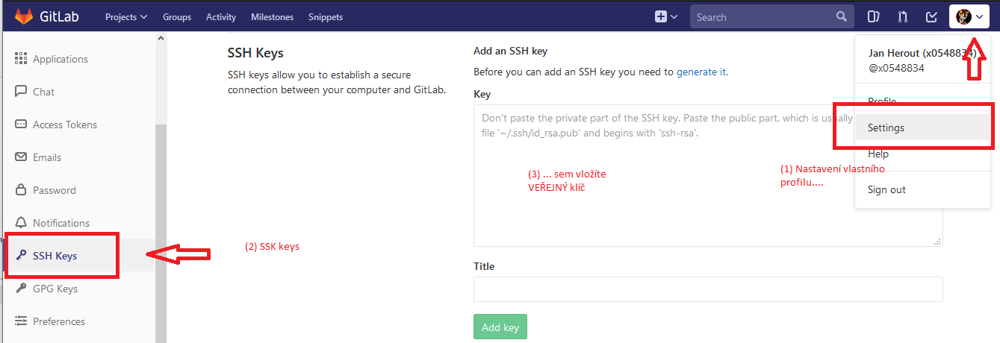
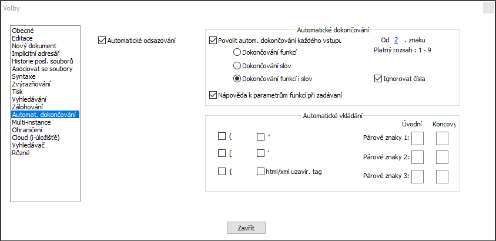
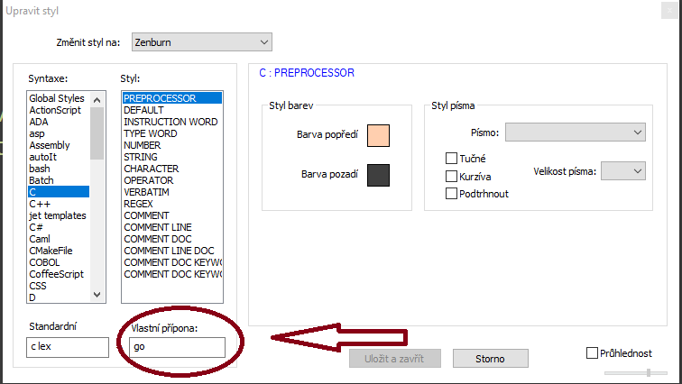

# Příprava prostředí

## Co se naučíme

- Instalace kompilátoru jazyka Go (Windows)
- Instalace Gitu, jeho základní nastavení; náhrada textového editoru `vim` za něco "méně esoterického"
- Konfigurace Notepad++

### Instalace jazyka Go

- stáhněte si poslední verzi jazyka Go z adresy [https://golang.org/dl/](https://golang.org/dl/)
- spusťte instalátor
- po výzvě zvolte instalaci do vhodného umístění (`C:\Program Files\Go`)

Žádná konfigurace v tomto bodě není nutná.

### Git

Pokud jste nikdy s nástrojem Git nepracovali, nezoufejte, základy se naučíte rychle.

Máte-li čas, doporučuji projít si po instalaci (viz níže) tento [tutorial](https://www.atlassian.com/git/tutorials/setting-up-a-repository) -
ve finále nás zajímá především část "saving changes".

Nemáte-li čas, stáhněte si prosím tento [cheat sheet](https://www.atlassian.com/git/tutorials/setting-up-a-repository),
a někam si ho uschovejte pro další práci. V práci na tomto "projektu" budete
nejčastěji potřebovat následující příkazy:

| co              | proč                                                                                                               |
| --------------- | ------------------------------------------------------------------------------------------------------------------ |
| `git add --all` | připraví k commitu všechny změny, ke kterým v repository došlo                                                     |
| `git commit`    | spustí textový editor, vyzve vás k zadání "commit message"; pokud editor ukončíte bez úprav, commit **neproběhne** |
| `git pull`      | zapraucuje změny ze serveru na lokální souborový systém                                                            |
| `git push`      | zašle lokální změny na server                                                                                      |

Ostatní si ukážene tak, jak půjdeme "projektem".

### Instalace nástroje Git

- stáhněte si [git](https://git-scm.com/downloads), doporučuji 64-bit verzi
- spusťte instalaci, instalátor se postupně ptá na jednotlivé volby

| dialog                                                     | doporučení                  |
| ---------------------------------------------------------- | --------------------------- |
| Only show new options                                      | nechte zaškrtnuté           |
| Adjusting the name of the initial branch in new repository | Let Git decide              |
| Choose a credential helper                                 | Git Credential Manager Core |

### Konfigurace Gitu a GitLabu

#### Vygenerování klíče

**POZOR** - následující postup je destruktivní, pokud již máte nějaký ssh klíč vygenerovaný!

Pokud jste na Windows 10, spuťte příkazovou řádku (`cmd`), a na ní spusťte:

```
ssh-keygen -t rsa -C "vaše.adresa@o2.cz" -b 4096
```

Doporučuji následující odpovědi na otázky programu `ssh-keygen`.

| výzva                                                                   | odpověď                                           |
| ----------------------------------------------------------------------- | ------------------------------------------------- |
| `Enter file in which to save the key (C:\Users\<username>/.ssh/id_rsa)` | stiskněte `enter`, cestu nebudeme upravovat       |
| `Enter passphrase (empty for no passphrase):`                           | `enter` - pro naše současné účely stačí bez hesla |
| `Enter same passphrase again:`                                          | `enter` - bez hesla                               |

Následně uvidíte něco jako:

```
Your identification has been saved in C:\Users\janhe/.ssh/id_rsa.
Your public key has been saved in C:\Users\janhe/.ssh/id_rsa.pub.
The key fingerprint is:
SHA256:PzTcXgWH2MU+WtJVkWbd4zea4qsid1Uu0k6crmA0pk0 jan.herout@o2.cz
The key's randomart image is:
+---[RSA 4096]----+
|             o.=X|
|            . oB=|
|              =.+|
|         . . o Bo|
|       ES * = B +|
|      * .+ @ *   |
|     . +  X +    |
|     ..o.. =     |
|      o ooo..    |
+----[SHA256]-----+
```

Vznikly dva soubory pod adresáři našeho uživalelského profilu (u mě je to `C:\Users\janhe`).

- `.ssh/id_rsa` - soukromý klíč - který nikdy nikomu nedáváme
- `.ssh/id_rsa.pub` - veřejný klíč - který je možné bezpečně poskytnout třetím stranám

**HINT**

- generovali jsme klíč bez hesla, to znamená, že kdokoliv kdo má
  k dispozici soubor vygenerovaný soubor `.ssh/id_rsa` se může
  prokázat naší identitou - sobor nikomu nedávat, neposílat mailem, apod.
- složka `.ssh` se dá zálohovat, a možná je vhodné to udělat (na bezpečné místo)

#### Konfigurace Gitu

Z příkazové řádky zadejte následující příkazy, použijte svoje nacionále.

```
git config --global user.name "[firstname lastname]"
git config --global user.email "[valid-email]"
git config --global color.ui auto
```

Pokud jste nikdy nepracovali s editorem `vim`, doporučuji ještě následující.

##### Stažení editoru Micro

`micro` je jednoduchý, "user friendly" textový editor pro konzolové aplikace, a můžete ho
získat [zde](https://1drv.ms/u/s!AviGc0QhRWWrrRUS7qkP42HRy3G3?e=Pu6vxZ).
Soubor si stáhněte, a umístěte si ho do do nového adresáře, například:

`c:\apps\micro\micro.exe`

##### Konfigurace Gitu tak, aby používal Micro

Z příkazové řádky spusťte následující příkaz - cestu upravte tak, aby "odkazovala" na místo, kam jste uložili spustitelný soubor.

```
git config --global core.editor c:\apps\micro\micro.exe
```

Co potřebujete vědět o textovém editoru:

| klávesová zkratka | význam                                                                                                             |
| ----------------- | ------------------------------------------------------------------------------------------------------------------ |
| `Ctrl+Q`          | quit - zeptá se vás, zda chcete uložit ještě neuloženou práci (commit message) - pozor, odpověď `n` _ruší_ commit! |
| `Ctrl+S`          | save                                                                                                               |

#### Konfigurace GitLabu

Po vyřízení požadavku na roli `GITLABCE-DEVELOPER` vám přijde zhruba následující mail:

```
Hi Jan Herout (x0548834)!
Your account has been created successfully.
login.......................................... jan.herout@o2.cz
Click here to set your password
This link is valid for 2 days. After it expires, you can request a new one.
```

Postupujeme dle instrukcí v mailu, a nastavíme si heslo. Login na GitLab je shodný s naším doménovým jménem.

Následně se na GitLab přihlásíme, a přidáme si do profilu **veřejný** klíč vygenerovaný v předchozím kroku.



#### Přístupy na repository

Pošlete mi na adresu `jan.herout@o2.cz` svůj logon, dám vám práva na repository, kde budeme sdílet kód.

## Git - základy

Pro naše úč

## Nastavení Notepad++

Tento text shrnuje jak si nastavuji Notepad++ já - berte to jako doporučení.

### Česká lokalizace

- Menu `Settings` / `Preferences`/ `General`
- nastavte `Localization` na `Česky`

### UTF-8 jako default pro nové soubory

- Menu `Nastavení` / `Volby`/ `Nový dokument`
- Formát nechte `Windows`, kódování zvolte `UTF-8 (bez BOM)`

### Automatické dokončování (našeptávač)

- Menu `Nastavení` / `Volby`/ `Automat. dokončování`
- Zvolte `Povolit autom. dokončování každého vstupu`
- Zvolte `Dokončování funkcí i slov`
- Zadejte `Od 2 znaku`



### Syntaxe C pro Go

- Menu `Nastavení` / `Upravit styl`
- Zvolte syntax `C`
- Dopište do pole `Vlastní přípona` extenzi `go`

