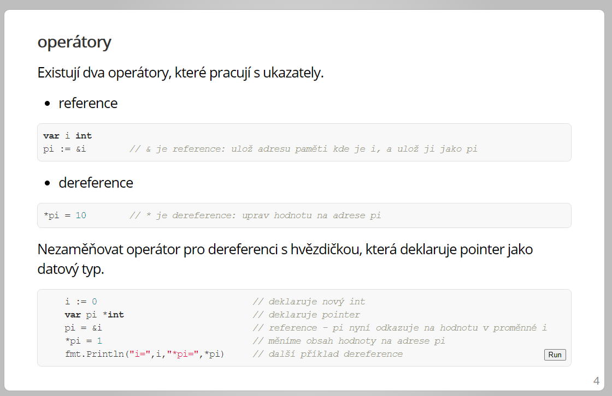

# Golang slides

## Odkazy

Tutorial, cheat sheets

- [Tour of go](https://tour.golang.org/list) - Naprosté základy jazyka, a jeho syntaxe.
- [Go By Example](https://gobyexample.com/) - Příklady které demostrují řešení základních úloh v jazyce Go.
- [Go Cheat Sheet](https://github.com/LeCoupa/awesome-cheatsheets/blob/master/languages/golang.md)
- [Go slice tricks](https://ueokande.github.io/go-slice-tricks/)

Free, online books

- [Go Bootcamp](http://www.golangbootcamp.com/)
- [Learn Go with Tests](https://quii.gitbook.io/learn-go-with-tests/) - Naprosté základy + TDD
- [Spaceship Go](https://blasrodri.github.io/spaceship-go-gh-pages/cover.html) - Tak trochu filozofické čtení; nejspíš nevhodné, pokud s Go začínáte - text oceníte až s odstupem.
- [Webapps in Go the anti text book](https://thewhitetulip.gitbook.io/bo/)

Vybrané knihovny (můj vlastní seznam)

- [libraries.md](libraries.md)

Online školení (free)

- https://gophercises.com/

Best Practices

- [https://github.com/golang/go/wiki/CodeReviewComments#go-code-review-comments]

Libraries

- [Awesome Go](https://github.com/avelino/awesome-go)


Prezentace jednoho z autorů jazyka (youtube)

- [Rob Pike: Go proverbs](https://www.youtube.com/watch?v=PAAkCSZUG1c)
- [Rob Pike: Simplicity Is Complicated](https://www.youtube.com/watch?v=rFejpH_tAHM)

Další zdroje na youtube

- [Matt KØDVB](https://www.youtube.com/channel/UCC2ot8w_U6yQsq7jdpbECvQ/videos) - kompletní průchod jazykem a vybrané části standardní knihovny. **Velmi** dobře udělaný kurs!
- [justforfunc](https://www.youtube.com/channel/UC_BzFbxG2za3bp5NRRRXJSw) - dedikovaný kanál
- [go pointers](https://www.youtube.com/watch?v=sTFJtxJXkaY&t=109s)

Tools - "náhodná" kolekce užitečných nástrojů, napsaných v Go.

- [modd](https://github.com/cortesi/modd)
- [sift](https://github.com/svent/sift)
- [hugo](https://gohugo.io/)
- [kristy](https://github.com/spotlightpa/kristy)


## Slides

V jednotlivých adresářích jsou uložené výukové materiály /soubory s příponou `.slide`) a ukázkové programy (soubory s příponou `.go`).
Tyto soubory je možné [normálně](10-about/10-about-golang.slide) zobrazit jako text, ale mnohem lepší bude když použijete nástroj, který je přímo k tomu určený.
Viz níže.

Pokud dodržíte níže popsaný postup, budou slajdy vypadat zhruba takhle:



Přímo ze slajdů je možné si spouštět ukázkové programy, a pokud použijete chrome, máte k dispozici syntax highlighting.

## Presenter

K použití tohoto repository je vhodné mít nainstalovaný GoLang. 
Získáte ho na adrese [golang.org](https://golang.org/).

Následně je zapotřebí nainstalovat `presenter`. Ten získáte 
z příkazové řádky, následujícím způsobem:

```
go install golang.org/x/tools/cmd/present@v0.1.0
```

Dojde ke stažení a kompilaci tohoto nástroje. Stažení probíhá odklonováním
Git repository, může se proto hodit (pokud budete řešit problémy 
s konektivitou) následující [návod](https://gitlab.com/Herout/cheatsheet/-/blob/master/content/git_behind_proxy.md)

## Spuštění prezentací

- spusťe příkazovou řádku
- přepněte se do adresáře, kde je toto repository
- spusťte z příkazové řádky program `prsent` takto:
    - WIN : `present -base "%GOPATH%/src/golang.org/x/tools/cmd/present"`
    - MAC - upravte si cestu podle toho, jaké je vaše uživatelské jméno: `/Users/richard/go/bin/present -base /users/richard/go/pkg/mod/golang.org/x/tools@v0.1.0/cmd/present`
- jděte v prohlížeči na adresu  [127.0.0.1:3999](http://127.0.0.1:3999)

**best presented in Chrome**

- [Chrome syntax highlighter](https://chrome.google.com/webstore/detail/go-present-code-highlight/depioieabmbifhmkflcagceedklkiahb)

## Help!

Problém:

- Prezentace běží z adresy [localhost:3999](http://localhost:3999)
- V command okně, kde běží present, je následující chyba: `2021/02/26 10:23:39 bad websocket origin: http://localhost:3999`
- Nedaří se spustit pčíklady

Workaround:

- Nahoře píšu:

> jděte v prohlížeči na adresu  127.0.0.1:3999

- Tak to tak udělejte (ne na LOCALHOST) :  [127.0.0.1:3999](http://127.0.0.1:3999)


